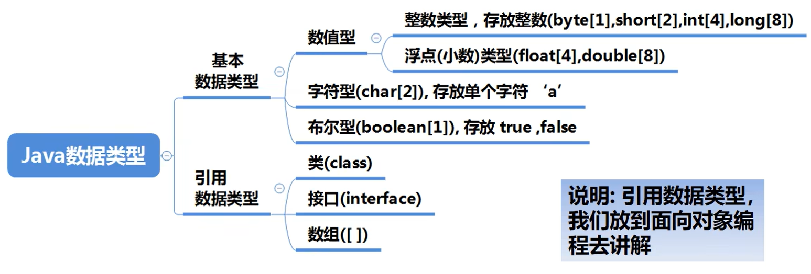
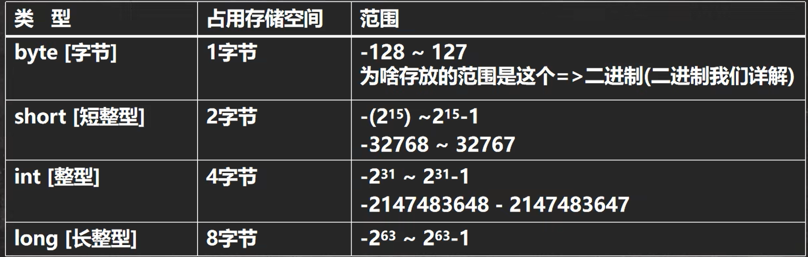
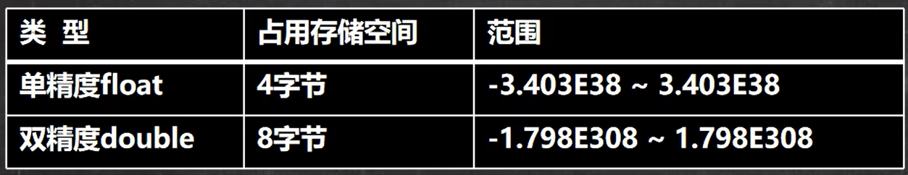
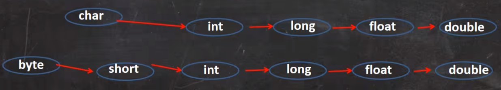

# Java 简介

一个Java程序可以认为是一系列对象的集合，而这些对象通过调用彼此的方法来协同工作。下面简要介绍下类、对象、方法和实例变量的概念。

- 对象：对象是类的一个实例，有状态和行为。例如，一条狗是一个对象，它的状态有：颜色、名字、品种；行为有：摇尾巴、叫、吃等。
- 类：类是一个模板，它描述一类对象的行为和状态。
- 方法：方法就是行为，一个类可以有很多方法。逻辑运算、数据修改以及所有动作都是在方法中完成的。
- 实例变量：每个对象都有独特的实例变量，对象的状态由这些实例变量的值决定。
# Java 特点

1. Java语言是面向对象的（oop）。
2. Java语言是健壮的。Java的强类型机制、异常处理、垃圾的自动收集等是Java程序健壮性的重要保证。
3. Java语言是跨平台性的。
4. Java语言是解释型的。
# Java 转义字符

Java 常用的转义字符

|  符号  |      作用       |
| :--: | :-----------: |
| `\t` | 一个制表位，实现对齐功能。 |
| `\n` |      换行符      |
| `\\` |     一个`\`     |
| `\"` |     一个`"`     |
| `\'` |     一个`'`     |
| `\r` |     一个回车      |
# Java 注释

介绍：用于注解说明解释程序的文字就是注释，注释提高了代码的阅读性（可读性）；注释是一个程序员必须要具有的良好编程习惯。将自己的思想通过注释先整理出来，再用代码去体现。

Java中的注释类型
- 单行注释
	- 格式： `// 注释文字`
- 多行注释
	- 格式：`/* 注释文字 */`
- 文档注释

使用细节
1. 被注释的文字，不会被JVM解释执行
2. 多行注释里面不允许有多行注释嵌套
# Java 变量

变量是程序的基本组成单位。
## 变量的介绍

概念：变量相当于内存中一个数据存储空间的表示，你可以把变量看做是一个房间的门牌号，通过门牌号我们可以找到房间，而通过变量名可以访问到变量（值）。
## 加号的使用

1. 当左右两边都是数值型时，则做加法运算。
2. 当左右两边有一方为字符串，则做拼接运算。
## 数据类型

每一种数据都定义了明确的数据类型，在内存中分配了不同大小的内存空间（字节）。

1. Java数据类型分为两大类，基本数据类型，引用类型。
2. 基本数据类型有8种，数值型`byte,short,int,long,float,double,char,boolean`。
3. 引用类型`类，接口，数组`。
## 整数类型

基本介绍：Java的整数类型就是用于存放整数值的。

整数的类型

细节：
1. Java各整数类型有固定的范围和字段长度，不受具体OS的影响，以保证Java程序的可移植性。
2. Java的整型常量默认为int型，声明long型常量须后加 ‘l’ 或者 ‘L’。
3. Java程序中变量常声明为int型，除非不足以表示大数，才使用long。
4. bit：计算机中的最小存储单位。
5. byte：计算机中基本存储单元，1 byte = 8 bit。
## 浮点类型

基本介绍：Java的浮点类型可以表示一个小数。

浮点型的分类

说明：
1. 关于浮点数在机器中存放形式的简单说明，`浮点数 = 符号位 + 指数位 + 尾数位`。
2. 尾数部分可能丢失，造成精度损失（小数都是近似值）。

细节：
1. Java的浮点类型也有固定的范围和字段长度，不受具体OS的影响。
2. Java的浮点型常量默认为double型，声明float型常量，须后加 'f' 或 'F'。
3. 浮点型常量有两种表示形式：十进制数形式和科学计数法形式。
4. 通常情况下，应该使用double型，它比float型更精确。
5. 浮点数使用陷阱：2.7 和 8.1/3 比较。
## 字符类型

基本介绍：字符类型可以表示单个字符，字符类型是char，char是两个字节（可以存放汉字），多个字符我们用字符串String。

细节：
1. 字符常量是用单引号` ' ' `括起来的单个字符。
2. Java中还允许使用转义字符` '\' `来将其后的字符转变为特殊字符型常量。
3. 在Java中，char的本质是一个整数，在输出时，是unicode码对应的字符。
4. 可以直接给char赋一个整数，然后输出时，会按照对应的unicode字符输出。
5. char类型是可以进行运算的，相当于一个整数，因为它都有对应的unicode码。

本质讨论：
1. 字符型存储到计算机，需要将字符对应的码值（整数）找出来。
2. 字符和码值的对应关系是通过字符编码表决定的。
## 布尔类型

基本介绍：
1. 布尔类型也叫boolean类型，boolean类型数据只允许取值true和false，无null。
2. boolean类型占1个字节。
3. boolean类型适用于逻辑运算，一般用于程序流程控制。

细节：

不可以0或非0的整数替代false和true。
## 基本数据类型转换

### 自动类型转换

介绍：当Java程序在进行赋值或者运算时，精度小的类型自动转换为精度大的数据类型，这就是自动类型转换。

数据类型按精度（容量）大小排序为：

细节：
1. 有多种类型的数据混合运算时，系统首先自动将所有数据转换成容量最大的那种数据类型，然后再进行计算。
2. 当我们把精度（容量）大的数据类型赋值给精度（容量）小的数据类型会报错。
3. byte、short和char之间不会互相自动转换。
4. byte，short，char他们三者可以计算，在计算时首先转换为int类型。
5. boolean不参与转换。
6. 自动提升原则：表达式结果的类型自动提升为操作数中最大的类型。